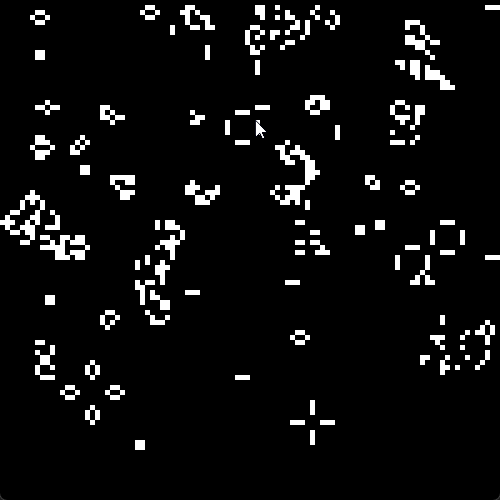

# Conway's Game of Life con números primos

Quería probar qué pasaba si usaba números primos para el juego de la vida de Conway.

En lugar de poner las células vivas al azar o con patrones clásicos, decidí usar los píxeles que corresponden a números primos para que empiecen vivos. Si la posición del píxel es un número primo, la celda arranca viva.

Después, el juego corre con las reglas normales:

- Una célula viva con menos de dos vecinos muere (soledad).
- Una célula viva con dos o tres vecinos sigue viva.
- Una célula viva con más de tres vecinos muere (sobrepoblación).
- Una célula muerta con justo tres vecinos vivos revive.

Es divertido ver cómo el patrón de primos evoluciona, porque no es algo que uno vea todo el tiempo en el juego.

---

## Cómo correrlo

Solo tenés que clonar el repo y correrlo con Cargo:

```bash
git clone https://github.com/jlope384/Lab2ConwaysGameOfLife.git
cd Lab2ConwaysGameOfLife
cargo add raylib
cargo run

